<p align="center">
  
</p>

#**TWITTERMON**

TwitterMon is a module developed for [AIL framework](https://github.com/CIRCL/AIL-framework), a platform that analyses potential information leaks in unstructured data sources such as PasteBin, which allows to monitor the content published in Twitter either within a certain period of time or in real time, in addition to performing a sentiment analysis and a statistical analysis of the publications collected.

The main features of the module are the following:

-   It is fully integrated into AIL, injecting the Tweets collected into the flow of data leakage treatment and analysis established in the platform.

-   It’s independent from the Twitter API. It emulates the queries of a web browser, and therefore it does not need any type of registration or authentication nor it is limited by the functions of the official API.

-   It performs a sentiment analysis designed specifically for the type of publications made on Twitter, including emojis and emoticons and the type of language used on that social platform.

</br>
The three main components of the TwitterMon module are:

-   **Monitor Panel**: It allows to start a new monitoring or resume a previous search.

-   **Analyzer**: It displays all the searches performed with the result of the statistical and sentiment analysis.

-   **Settings**: It allows to configure certain parameters of the module.

</br></br>
Installation
============

Two installation modes are presented, an automatic one that performs the deployment on an existing installation of the AIL platform and another manual that describes the steps to follow to perform the installation.


</br></br>

Requirements
------------

-   AIL Framework v2.2, v2.3, v2.4 or v2.5 (not tested in later versions).

-   Python \>3 (AIL already configures a Python3 virtual environment in AILENV).

-   PyQuery library.

-   [VaderSentiment library](https://github.com/cjhutto/vaderSentiment).

**Note:** Automatic updates of AIL can be deactivated using the **auto_update** field that can be found in the AIL -framework / configs / **update.cfg**

</br>

Automatic installation
----------------------

For an automatic installation, simply run the **installTM.sh** file that is provided with the solution installation package. This file will copy the module files to the AIL platform folders, modify the necessary AIL platform files (using the python file **modifyAIL.py**) and install the dependencies that the system needs.
</br>
<code>installTM.sh</code>

</br>

Manual installation
-------------------

The following method, in addition to being useful if there is a problem with the automatic installation, allows you to see the necessary dependencies and the changes that must be made on the AIL platform to deploy the Twitter monitoring module.

### 1. Copy files

It is necessary to copy the files and folders indicated in the left column to the AIL folders indicated in the right column.

| **Installation package**              | **AIL Framework**                  |
|---------------------------------------|------------------------------------|
| AIL_bin/packages/**Tweet.py**             | \$AIL-framework/bin/packages       |
| AIL_bin/**TwitterAnalyzer.py**            | \$AIL-framework/bin                |
| AIL_var/www/modules/**TwitterMon**/       | \$AIL-framework/var/www/modules/   |
| AIL_var/www/templates/**twittermon**/     | \$AIL-framework/var/www/templates/ |

</br>

### 2. Install libraries

The system requires the PyQuery and VaderSentiment libraries to be installed in the Python3 virtual environment of the AIL platform:

-   \$AIL-framework/AILENV/bin/**pip3 install pyquery**

-   \$AIL-framework/AILENV/bin/**pip3 install vaderSentiment**

**Note:** The Python virtual environment of the AIL platform is activated with the following command:
<pre>
source ~/AIL-framework/AILENV/bin/activate
</pre>

</br>

### 3. Modify AIL files

Finally, it is necessary to modify the following AIL files as indicated:

**\$AIL-framework/bin/packages/modules.cfg**

Add the following entry:
<pre>[TwitterAnalyzer]
subscribe = Redis_Global
</pre>
</br>

**\$AIL-framework/bin/LAUNCH.sh**

Include the execution of the Tweets processing script:
<pre>sleep 0.1
screen -S "Script_AIL" -X screen -t "TwitterAnalyzer" bash -c "cd ${AIL_BIN}; ${ENV_PY} ./TwitterAnalyzer.py; read x"
</pre>
</br>

**\$AIL-framework/var/www/templates/nav_bar.html**

Include the link, in the top navigation bar, to the TwitterMon module:
```html
<li class="nav-item mr-3">
<a class="nav-link" id="page-options" href="{{ url_for('TwitterMon.TwitterMon_page') }}" aria-disabled="true"><i class="fab fa-twitter"></i> Twitter Monitor</a>
 </li>
```
</br>
Once these steps have been completed, the AIL platform can be launched through its execution script:

```bash
~\$AIL-framework/bin/LAUNCH.sh -l
```
</br>

User Manual
===========

</br>
</br>

### 1. Accessing TwitterMon
--------------------

While the AIL platform is running, the Twitter monitoring page, **TwitterMon**, is available through the AIL top menu, or by accessing the following address:

<code>https://AIL-SERVER-IP:7000/TwitterMon</code>

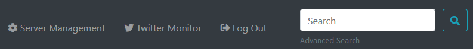

</br>
</br>

### 2. Monitoring page
---------------

The monitoring page, presented below, allows the user to start a new monitoring or resume a previous search. If a search is resumed, the Tweets that are collected in the new search will be added to the old one. It is important to note that to resume a monitoring you only have to use the same search name in the [**Search name**] field that was used in the search you want to continue and it is not necessary to set the same search parameters, which allows greater flexibility in searches.

**Note:** The system will notify the user, in the TwitterMon console, if the name of the search already exists in the database.

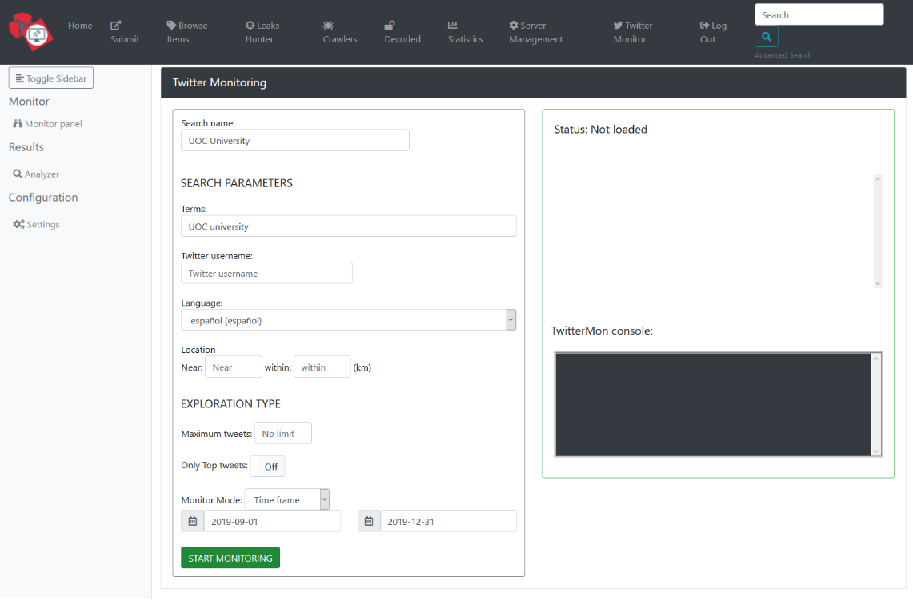

</br>
</br>


### 3. Configuring the search
----------------------

Apart from the descriptive name that the user must give to the search by means of the [**Search Name**] field, the following fields are **mandatory** for monitoring (at least one of them):

-   **Terms**: Terms, separated by spaces, to look for in the content of the Tweets. It allows to exclude terms by putting the sign "-" before the term.

-   **Twitter Username**: Publications of a specific user will be searched.

-   **Near**: Publications made in a specific place and radius of action (field [**within**]) will be searched.

</br>
In addition, the system allows to configure other parameters in the search:

-   **Language:** The system will collect only the publications made in a specific language.

-   **Maximum tweets**: Maximum number of Tweets to collect.

-   **Only Top Tweets**: The system will only search in the Top Tweets.

</br>

Once the parameters have been established, the user must choose through the [**Monitor Mode**] field between a real-time monitoring or the monitoring of a specific period, for which the start and end date will be required.

Monitoring will begin as soon as the user presses the [**Start Monitoring**] button:
<p align="center">
  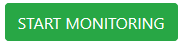
</p>

</br>
</br>


### 4. Monitoring status
-----------------

The status of the monitoring will be displayed on the right side of the page, in addition to the collection progress and the Tweet text that is currently being sent to the AIL queue.


<p align="center">
  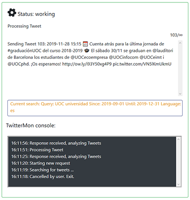
</p>

</br>
As soon as the first Tweet has been sent to the processing queue, the results will begin to appear in the Analyzer page.

</br>
</br>

### 5. Analyzer: Checking the results
------------------------------

The results page shows the list of searches performed, as well as the detail and analysis performed on each of the samples.

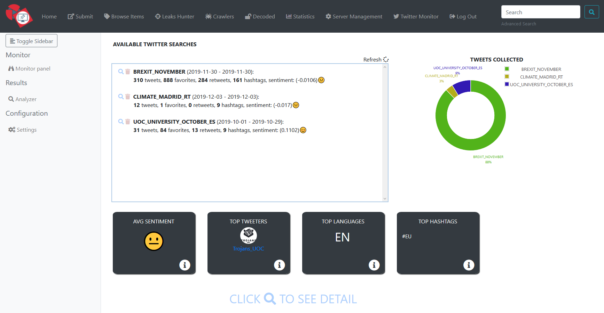

</br>

The interface has **THREE DIFFERENT AREAS**:

</br>
</br>

The **UPPER AREA lists the searches performed**, along with a summary of those searches such as the number of tweets, the number of hashtags or the result of sentiment analysis.

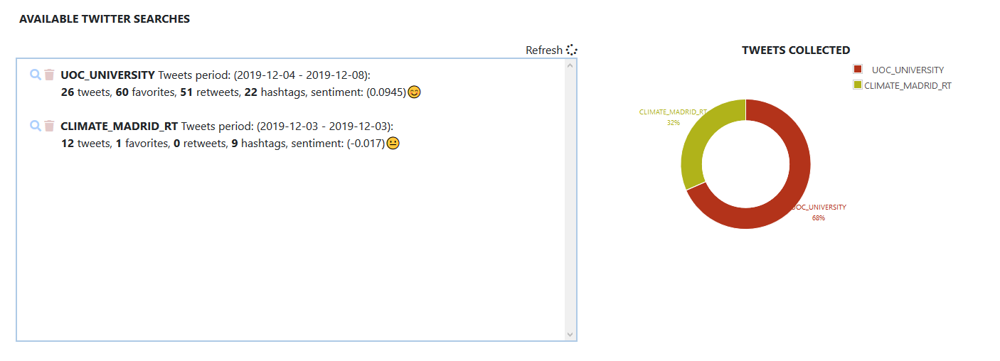

Through the  icon you can delete a search, and through the  icon you can access the analysis detail.

</br>

The **CENTRAL AREA shows information of interest related to all the searches** carried out, indicating the average feeling of all the searches, the Tweeters that appear most in the searches, the most used languages and the hashstags with more appearances.

<p align="center">
  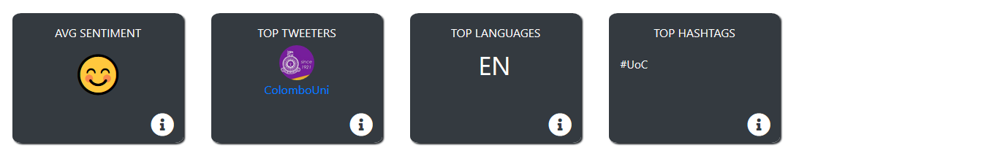
</p>

</br>

The relationship between the sentiment icon shown and the value obtained in the analysis is as follows:

<p align="center">
  
</p>

Check the [vaderSentiment](https://github.com/cjhutto/vaderSentiment) tool for more information regarding the sentiment analysis performed.

</br>
</br>

The **LOWER AREA**, once a search is selected, **contains the detail of the analysis performed on that search**.

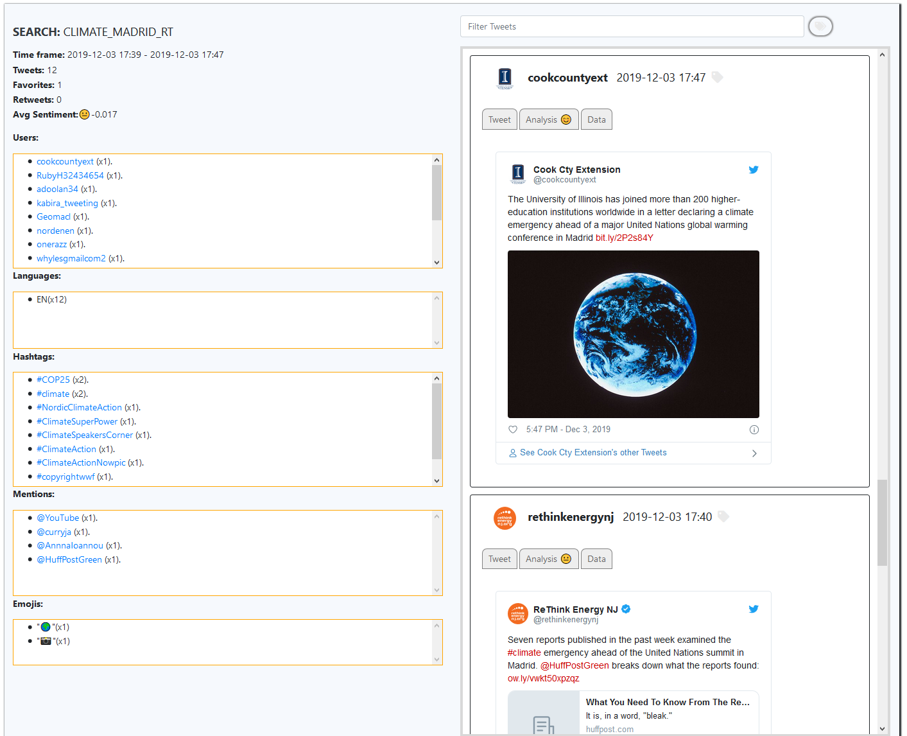

This area is divided into two sections: the left column shows the information from the search analysis while the right column shows the tweets collected along with information about their treatment.

</br>

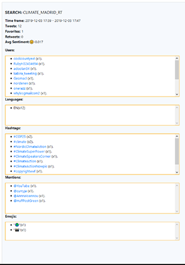 This section shows general information from the search such as the time period in which the Tweets were published, as well as the average sentiment and the number of Tweets, favorites and retweets.In addition, all users, languages, hashtags, mentions and emojis of the collected Tweets are listed in different areas, ordered by the number of occurrences. Each one of them provide a link to the Twitter official element.

</br>
</br>
</br>
</br>
</br>
</br>
</br>
</br>
</br>
</br>
</br>
</br>
</br>
</br>
</br>


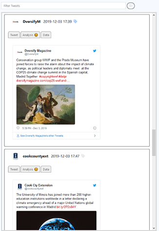 This panel with vertical scroll shows all the tweets that have been collected in the search, as well as the following information for each of them:

-   The Tweet in the official Twitter layout.

-   Raw text of the tweet.

-   The text of the tweet translated into English.

-   The result of the sentiment analysis performed.

</br>
</br>

**Important Tweets**: the user can label the Tweet as important through the  icon.

</br>
</br>
</br>
</br>
</br>
</br>

The module allows filtering the Tweet list by entering terms in the search bar. In addition, by pressing the  icon, you can filter the Tweets labelled as important.

<p align="center">
  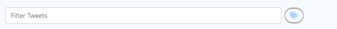
</p>

</br>
</br>

### 6. Configuring the module
----------------------

The configuration page allows to modify certain parameters of the TwitterMon module.

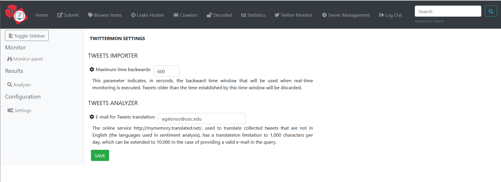

The parameters that can be configured are the following:

- Maximum Time Backwards: This parameter establishes in seconds the backward time window that will be used when real-time monitoring is being done. Tweets that have an older date than the one that marks the time window will be discarded.

- Translation e-mail: The online service http://mymemory.translated.net/, used to translate collected tweets that are not in English (the language used in sentiment analysis), has a translation limitation of 1,000 characters, which can be extended to 10,000 characters in the case of providing a valid e-mail in the query.
